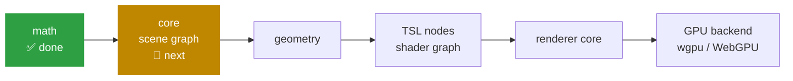

<div align="center">

# Kite3D

**A 3D engine written entirely in Kotlin — one codebase, every platform.**

A from-scratch port of [three.js](https://github.com/mrdoob/three.js) to Kotlin Multiplatform.

[](https://github.com/yuroyami/Kite3D/actions/workflows/ci.yml)


</div>

> [!IMPORTANT]
> **Kite3D cannot draw anything yet.** The math layer is finished and tested; the
> scene graph, geometry and renderer are still being ported. Today it is an
> excellent 3D **math** library for any Kotlin project. See [Status](#4-status--roadmap)
> for exactly where the work stands.

---

## 1. Why Kite3D

Kotlin runs on phones, desktops, servers and browsers. 3D graphics, so far, has not
followed it there. Your options have been:

| The usual approach | What it costs you |
|---|---|
| Wrap a C++ engine (Filament, Godot, bgfx) | Native binaries per platform, JNI/cinterop glue, painful debugging across the boundary |
| Use each platform's own stack (SceneKit + Android's OpenGL + three.js) | Three codebases, three sets of bugs, three teams' worth of knowledge |
| Write your own | Months of matrix math before a triangle appears |

Kite3D takes a fourth route: **rewrite the engine in Kotlin itself**.

- **One codebase.** The engine core is plain `commonMain` Kotlin — no `expect`/`actual`,
  no cinterop, no JNI, no native binary. It compiles anywhere Kotlin does.
- **No dependencies.** The core pulls in `kotlin-stdlib` and nothing else.
- **A known-good design.** three.js has had fifteen years of real-world use to shape
  its API. Kite3D ports that design rather than inventing a new one, so anyone who
  has touched three.js already knows their way around — and there is a huge body of
  tutorials and answers that still applies.
- **Debuggable.** Step into `Matrix4.decompose` in your IDE and read the Kotlin. No
  opaque native frame, no "here be dragons" boundary.

> **New to 3D?** A 3D engine is really two things: a pile of maths that decides
> *where* things are, and a renderer that turns that into pixels. Kite3D's maths
> half is done. Read on — you can use it today.

---

## 2. Getting it into your project

### Coordinates

```kotlin
// build.gradle.kts
kotlin {
    sourceSets {
        commonMain.dependencies {
            implementation("io.github.yuroyami:kite3d:0.1.0")
        }
    }
}
```

> [!NOTE]
> **Not on Maven Central yet.** `0.1.0` has not been released. Until it is, build it
> yourself — it takes one command:
>
> ```bash
> git clone https://github.com/yuroyami/Kite3D.git && cd Kite3D && ./gradlew publishToMavenLocal -PRELEASE_SIGNING_ENABLED=false
> ```
>
> then add `mavenLocal()` to your repositories.

Everything lives in one package, so a single import gets you started:

```kotlin
import io.github.yuroyami.kite3d.math.*
```

### The API in a nutshell

Four rules cover nearly the whole library. Learn these and the rest is discoverable.

**① Objects are mutable, and methods return `this` so you can chain.**

```kotlin
val v = Vector3(1.0, 2.0, 3.0)
    .multiplyScalar(2.0)
    .add(Vector3(0.0, 1.0, 0.0))
    .normalize()
```

This is deliberate. A renderer touches these types thousands of times per frame;
allocating a fresh object for every intermediate result would keep the garbage
collector busier than the GPU. The trade-off is that **`a.add(b)` changes `a`** —
when you want to keep the original, `clone()` first.

**② Methods that produce a *new kind* of value write into a target you supply.**

```kotlin
val center = Vector3()          // you own this
box.getCenter(center)           // filled in, and also returned
```

Same reason: no allocation. The target is returned too, so `box.getCenter(Vector3())`
is fine when you don't care.

**③ `set…` reads, `get…` writes, `…To` measures.**

```kotlin
quaternion.setFromEuler(euler)      // read from
box.getSize(target)                 // write into
a.distanceTo(b)                     // measure between
```

**④ Everything is `Double`.**

three.js runs on JavaScript numbers, which are 64-bit floats. Kite3D uses `Double`
so results match three.js exactly — including its test suite. `Float` appears only
further down the stack, where data is handed to the GPU.

> [!TIP]
> Two things to watch for, both inherited from three.js on purpose:
> constructors like `Sphere(center, radius)` **keep a reference** to the vector you
> pass (mutate it later and the sphere moves), and none of these types are
> thread-safe. Keep an object graph on one thread.

---

## 3. What it's good for today

Anything that needs to answer "where is it, how big is it, and does it touch that?"
— in a KMP shared module, with no platform code.

<table>
<tr><td width="50%">

**Move and place things**

```kotlin
val position = Vector3(0.0, 1.0, 0.0)
val target = Vector3(3.0, 1.0, 4.0)

position.distanceTo(target)   // 5.0

val direction = target.clone()
    .sub(position)
    .normalize()              // (0.6, 0.0, 0.8)
```

</td><td width="50%">

**Build a transform, then take it apart**

```kotlin
val model = Matrix4().compose(
    Vector3(0.0, 2.0, 0.0),                 // position
    Quaternion().setFromEuler(              // rotation
        Euler(0.0, PI / 2, 0.0),
    ),
    Vector3(1.0, 1.0, 1.0),                 // scale
)

Vector3(1.0, 0.0, 0.0).applyMatrix4(model)
// → (0.0, 2.0, -1.0)
```

</td></tr>
<tr><td>

**Decide what's on screen (frustum culling)**

```kotlin
val projection = Matrix4()
    .makePerspective(-1.0, 1.0, 1.0, -1.0, 0.1, 1000.0)

val frustum = Frustum()
    .setFromProjectionMatrix(projection)

val bounds = Box3().setFromPoints(meshVertices)

if (frustum.intersectsBox(bounds)) {
    // it's visible — worth drawing
}
```

</td><td>

**Shoot a ray at something (picking, hit tests)**

```kotlin
val ray = Ray(
    Vector3(0.0, 0.0, 5.0),     // origin
    Vector3(0.0, 0.0, -1.0),    // direction
)

val hit: Vector3? = ray.intersectSphere(
    Sphere(Vector3(), 1.0),
    Vector3(),
)                                // → (0.0, 0.0, 1.0)
```

</td></tr>
<tr><td>

**Blend colours correctly**

```kotlin
val red = Color(0xff0000)
val blue = Color(0x0000ff)

val mixed = Color().lerpColors(red, blue, 0.5)
mixed.getHexString()             // "bc00bc"
```

Not `7f007f` — Kite3D blends in **linear** light like
three.js does, which is what your eye expects.

</td><td>

**Orbit a camera around a point**

```kotlin
val spherical = Spherical()
    .setFromVector3(cameraOffset)

spherical.theta += 0.01          // swing sideways
spherical.phi -= 0.01            // and upward
spherical.makeSafe()             // don't flip over the pole

cameraOffset.setFromSpherical(spherical)
```

</td></tr>
</table>

**Also in the box:** `Box2`/`Box3` bounds, `Plane`, `Line3`, `Triangle` (barycentric
coordinates, interpolation), `Cylindrical`, `SphericalHarmonics3` for ambient
lighting, keyframe `Interpolant`s (linear, cubic, discrete, quaternion, bezier), a
full `ColorManagement` implementation, and `MathUtils` (clamping, easing, UUIDs,
seeded random, degree/radian conversion).

Full API reference: run `./gradlew dokkaGenerate` and open
`build/dokka/html/index.html`.

---

## 4. Status & roadmap

The port follows three.js's own dependency order — each layer is finished and tested
before the next one starts.



| Layer | three.js source | State |
|---|---|---|
| **math** | `src/math` | ✅ **Ported** — vectors, matrices, quaternion, euler, box, sphere, plane, ray, line, triangle, frustum, spherical, cylindrical, colour, interpolants |
| core / scene graph | `src/core`, `src/objects` | 🔨 Next — `Object3D`, `BufferGeometry`, `BufferAttribute`, `Raycaster` |
| cameras, lights, materials | `src/cameras`, `src/lights`, `src/materials` | Planned |
| geometry generators | `src/geometries` | Planned |
| TSL shader graph | `src/nodes` | Planned |
| renderer core | `src/renderers/common` | Planned |
| GPU backends | — | Planned — `wgpu-native` via cinterop (Metal / Vulkan / D3D12), WebGPU on the web |

<details>
<summary><b>A few math methods are deliberately deferred</b> (click to expand)</summary>

They reach into layers that don't exist yet, so they'll land with those layers.
Every one is tracked in [port-ledger.yaml](port-ledger.yaml):

- `Box3.setFromObject` / `expandByObject` — need `Object3D`
- `Frustum.intersectsObject` / `intersectsSprite` — need `Object3D` / `Sprite`
- All of `FrustumArray`'s intersection methods — need `ArrayCamera`
- `Vector3.project` / `unproject` — need `Camera`
- `Color.setStyle` / `setColorName` / `getStyle` — CSS string parsing and the 140-entry
  named-colour table

</details>

<details>
<summary><b>Every platform Kite3D compiles for</b> (click to expand)</summary>

**JVM** (bytecode target 11, so Android and older runtimes are fine) ·
**Android NDK** (arm32, arm64, x86, x64) ·
**iOS** (arm64, simulator arm64, x64) · **macOS** (arm64, x64) ·
**tvOS** · **watchOS** · **Linux** (x64, arm64) · **Windows** (mingw x64) ·
**JS** (browser + Node) · **Wasm** (wasmJs + WASI)

</details>

---

## 5. How the port is kept honest

A port is only worth as much as its fidelity. Three things enforce it:

**The upstream tests come across with the code.** three.js's own unit suites are
translated to `kotlin-test` and must pass. A class and its suite land in the same
commit — **452 tests** at present, plus a JVM-only suite that hammers the shared
types from many threads to prove the port really did remove three.js's module-level
scratch variables.

**Every engine runs them.** JVM, JS (Node), Wasm (Node and WASI) and native all run
the full suite in CI. This matters more than it sounds: `sin`, `cos` and `exp` are
not bit-identical across JavaScript, the JVM and native `libm`, so a tolerance that
passes in one place can fail in another.

**Every deviation is written down.** [port-ledger.yaml](port-ledger.yaml) records
each ported file, its test status, and every intentional difference from upstream —
why a JS idiom became a Kotlin enum, where a shared scratch variable became a local,
which method was deferred and what it's waiting on. [PORTING.md](PORTING.md) is the
dialect those decisions follow.

On top of that, the public API is dumped to `kite3d/api/` and checked on every
build, so a breaking change can't slip into a release unnoticed.

---

## 6. FAQ

**Is this a wrapper around three.js?**
No. There is no JavaScript involved anywhere. Every class is rewritten in Kotlin and
compiles to native code, bytecode or Wasm like any other Kotlin.

**Can I use it in an Android/iOS app today?**
For 3D maths, yes — it's a normal KMP dependency. For rendering, not yet.

**Why `Double` instead of `Float`? Isn't that slower on GPUs?**
The GPU never sees these types. Keeping `Double` in the math layer means results
match three.js bit-for-bit, which is what makes the ported test suite meaningful.
Buffers handed to the GPU will use `Float`.

**Which three.js version?**
`r184`. The revision is pinned in the ledger, and upgrades are done as deliberate
re-ports rather than drifting.

**How can I help?**
Port a file. [CONTRIBUTING.md](CONTRIBUTING.md) walks through getting the three.js
reference checkout, reading the dialect, and what "done" means.

---

## Contributing

Almost all work right now is porting three.js source files to Kotlin, in dependency
order. Start with [CONTRIBUTING.md](CONTRIBUTING.md), then
[PORTING.md](PORTING.md), then pick a `pending` entry from
[port-ledger.yaml](port-ledger.yaml).

## Related projects

Kite3D follows the KITE lineage — take a beloved library from another language and
bring it to Kotlin Multiplatform behind one coherent API: **KiteQR**,
**KiteTorrent**, **KitePDF**, **KiteCodec**.

## License

MIT. Kotlin port © 2026 yuroyami; original three.js © 2010-2026 three.js authors.
See [LICENSE](LICENSE).
